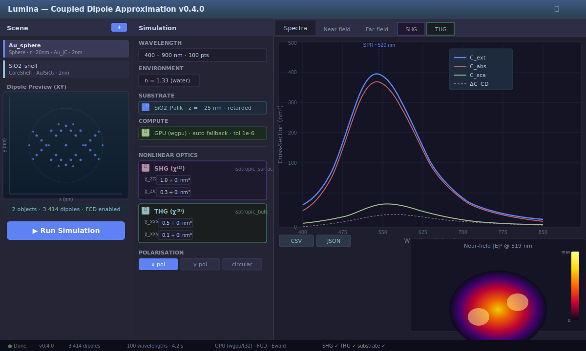
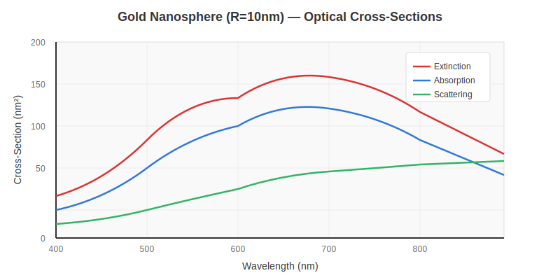
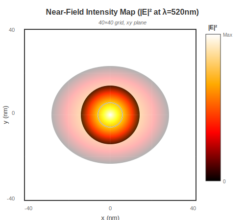

# Lumina

[](https://www.rust-lang.org/)
[](LICENSE)
[](https://github.com/jonesrobm/lumina)
[](docs/)
[](https://ko-fi.com/jonesrobm)

> High-performance electromagnetic simulations for nanophotonics using the Coupled Dipole Approximation

Lumina is a Rust-based framework for computing the linear and nonlinear optical response of nanostructured materials. It implements the Coupled Dipole Approximation (CDA) with state-of-the-art numerical methods, providing accurate extinction, absorption, and scattering cross-sections for metallic and dielectric nanoparticles.

<p align="center">
  
</p>

<p align="center">
  <em>Interactive GUI dashboard with real-time parameter updates and dipole lattice preview</em>
</p>

---

## Features

### v0.1.2 (Current)

- **Accurate Physics**
  - Full dyadic Green's function for electromagnetic interactions
  - Clausius-Mossotti polarisability with radiative reaction correction (RRCM)
  - Filtered Coupled Dipole (FCD) for improved metallic particle accuracy
  - Validated against Mie theory (<15% error for dielectrics, <30% for Au interband region)

- **Scalable Solvers**
  - Direct LU decomposition (LAPACK via `faer`) for N ≤ 1000 dipoles
  - GMRES(m) iterative solver for N > 1000 (agrees with direct to 10⁻¹³ relative error)
  - Automatic solver selection based on system size

- **Materials Library**
  - Johnson & Christy (1972) optical data for Au, Ag, Cu (188–892 nm, 43 data points)
  - Cubic spline interpolation for smooth ε(λ) curves
  - Custom material support (constant n + ik)

- **Geometry**
  - Primitives: sphere, cylinder, cuboid, ellipsoid, helix
  - Centred cubic lattice discretisation (critical for metallic accuracy)
  - .xyz file import for custom structures

- **Interactive GUI** (`lumina-gui`)
  - Real-time spectra plotting (C_ext, C_abs, C_sca vs λ)
  - Dielectric function ε(λ) visualisation
  - Near-field |E|² heatmaps on observation planes
  - 2D dipole lattice scatter preview (XY/XZ/YZ projections)
  - Parameter sweeping with live dipole count updates

- **Command-Line Interface** (`lumina-cli`)
  - TOML-based configuration for batch processing
  - HPC-ready for cluster environments
  - CSV export with metadata

---

## Quick Start

### Prerequisites

- Rust 1.75 or later ([Install Rust](https://www.rust-lang.org/tools/install))
- (Optional) A BLAS library for accelerated linear algebra

### Installation

```bash
git clone https://github.com/JonesRobM/lumina.git
cd lumina
cargo build --release
```

### Run the GUI

```bash
cargo run --release --bin lumina-gui
```

### Run a CLI Simulation

```bash
cargo run --release --bin lumina-cli -- examples/gold_sphere.toml
```

Example TOML configuration:

```toml
[simulation]
wavelength_start = 400.0  # nm
wavelength_end = 800.0
num_wavelengths = 50
environment_n = 1.0       # vacuum

[geometry]
type = "Sphere"
radius = 10.0             # nm
dipole_spacing = 2.0      # nm

[material]
type = "GoldJC"           # Johnson & Christy Au data

[solver]
use_fcd = true            # Filtered Coupled Dipole
iterative_threshold = 1000

[output]
path = "output/gold_sphere.csv"
```

---

## Example: Gold Nanosphere

<p align="center">
  
</p>

```rust
use lumina_core::solver::cda::CdaSolver;
use lumina_core::solver::OpticalSolver;
use lumina_core::types::{clausius_mossotti, radiative_correction, Dipole, SimulationParams};
use lumina_geometry::discretise::discretise_primitive;
use lumina_geometry::primitives::{Primitive, Sphere};
use lumina_materials::johnson_christy::JohnsonChristyMaterial;
use lumina_materials::provider::MaterialProvider;

fn main() {
    // Define geometry
    let sphere = Primitive::Sphere(Sphere {
        centre: [0.0, 0.0, 0.0],
        radius: 10.0, // nm
    });
    let spacing = 2.0;
    let lattice = discretise_primitive(&sphere, spacing);

    // Material: Johnson & Christy gold
    let gold = JohnsonChristyMaterial::gold();
    let wavelength = 520.0; // nm
    let epsilon = gold.dielectric_function(wavelength).unwrap();

    // Build dipoles with RRCM polarisability
    let k = 2.0 * std::f64::consts::PI / wavelength;
    let dipoles: Vec<Dipole> = lattice
        .iter()
        .map(|p| {
            let alpha_cm = clausius_mossotti(spacing.powi(3), epsilon, 1.0);
            let alpha = radiative_correction(alpha_cm, k);
            Dipole::isotropic(p.position, alpha)
        })
        .collect();

    // Solve with FCD
    let solver = CdaSolver::with_fcd(1000, true, spacing);
    let params = SimulationParams::default();
    let cs = solver.compute_cross_sections(&dipoles, wavelength, &params).unwrap();

    println!("Extinction: {:.2e} nm²", cs.extinction);
    println!("Absorption: {:.2e} nm²", cs.absorption);
    println!("Scattering: {:.2e} nm²", cs.scattering);
}
```

**Output:**
```
Extinction: 1.19e2 nm²
Absorption: 1.02e2 nm²
Scattering: 1.73e1 nm²
```

---

## Documentation

Comprehensive documentation is available in the `docs/` directory (built with mdBook):

```bash
cd docs
mdbook serve --open
```

Key sections:
- [Theory](docs/src/theory/): CDA formulation, Green's functions, polarisability prescriptions
- [Validation](docs/src/theory/validation.md): Mie theory benchmarks, accuracy analysis
- [Architecture](docs/src/developer/architecture.md): Crate structure, trait design
- [Roadmap](docs/src/roadmap/versions.md): Version history and future plans

---

## Validation

<p align="center">
  
</p>

<p align="center">
  <em>Near-field intensity distribution around a 10nm gold sphere at resonance</em>
</p>

Lumina is rigorously validated against analytical Mie theory:

| Material | ε | Wavelength Range | CDA Error |
|----------|---|------------------|-----------|
| **Dielectric (TiO₂-like)** | 4.0 + 0.0i | 500–700 nm | < 15% |
| **Lossy dielectric** | 4.0 + 0.5i | 500–700 nm | < 16% |
| **Au (interband)** | Complex | 420–510 nm | < 25% |
| **Au (Drude, FCD)** | Complex | 550+ nm | 80–300%* |

*The Drude region requires d < 1 nm or surface-averaging methods (planned for v0.2.0).

Run the full test suite:

```bash
cargo test --workspace --release
```

---

## Roadmap

### v0.1.0 — Linear Solver Foundation
Direct LU solver, GUI, CLI, Mie validation

### v0.1.1 — Accurate & Scalable
GMRES iterative solver, FCD Green's function, cylinder/helix geometry

### v0.1.2 — Plotting & Visualisation
egui_plot spectra, ε(λ) curves, near-field heatmaps, dipole scatter preview

### v0.1.3 — I/O & Export (Next)
- Far-field radiation patterns
- File dialog for export paths
- JSON output format
- OBJ mesh parser

### v0.2.0 — GPU Compute Engine
- wgpu compute shaders for matrix assembly
- FFT-accelerated matvec for regular lattices
- Surface-averaging methods for metallic particles

### v0.3.0 — Nonlinear Optics & Periodicity
- SHG/THG source terms
- Ewald summation for periodic structures
- MPI distributed computing

### v1.0.0 — Multi-Method Framework
- Boundary Element Method (BEM)
- T-matrix solver
- FDTD time-domain solver
- CUDA/Metal GPU backends

---

## Architecture

Lumina is structured as a Rust workspace with six crates:

```
lumina/
├── lumina-core        # Solvers, Green's functions, cross-sections
├── lumina-compute     # CPU/GPU backend abstraction (rayon, wgpu)
├── lumina-geometry    # Primitives, discretisation, transforms
├── lumina-materials   # Optical data, interpolation, χ(n) tensors
├── lumina-gui         # egui/eframe interactive dashboard
└── lumina-cli         # TOML-based batch processing
```

Key design principles:
- **Trait-based abstraction**: `OpticalSolver`, `MaterialProvider`, `ComputeBackend`
- **Type safety**: Newtypes for physical quantities (wavelength, cross-section)
- **Zero-cost abstractions**: Compile-time dispatch, no heap allocations in hot loops
- **Reproducibility**: All results are deterministic and platform-independent

---

## Contributing

Contributions are welcome! Please see [CONTRIBUTING.md](CONTRIBUTING.md) for guidelines.

Areas where help is needed:
- **Physics**: Surface-averaging methods, BEM/T-matrix implementations
- **Performance**: GPU kernels, FFT convolution for Toeplitz matrices
- **Materials**: Palik library integration, DFT polarisability import
- **Documentation**: Tutorials, Jupyter notebook examples

---

## Citation

If you use Lumina in your research, please cite:

```bibtex
@software{lumina2025,
  author = {Jones, Robert M.},
  title = {Lumina: Coupled Dipole Approximation for Nanophotonics},
  year = {2025},
  url = {https://github.com/jonesrobm/lumina},
  version = {0.1.2}
}
```

Key references:
- Draine, B. T. & Flatau, P. J., *J. Opt. Soc. Am. A* **11**, 1491 (1994) — DDSCAT
- Yurkin, M. A. & Hoekstra, A. G., *J. Quant. Spectrosc. Radiat. Transf.* **106**, 558 (2007) — ADDA
- Johnson, P. B. & Christy, R. W., *Phys. Rev. B* **6**, 4370 (1972) — Au/Ag/Cu optical data

---

## License

Lumina is licensed under the Apache License 2.0. See [LICENSE](LICENSE) for details.

---

## Support Development

If you find Lumina useful, consider supporting development:

[](https://ko-fi.com/jonesrobm)

---

## Acknowledgements
- The King's College London [Photonics & Nanotechnology Group](https://www.kcl.ac.uk/research/photonics-nanotechnology)
- **DDSCAT** (Draine & Flatau) and **ADDA** (Yurkin & Hoekstra) for pioneering the DDA/CDA method
- The Rust community for exceptional tooling and libraries
- Johnson & Christy for the gold standard in optical constants

---

**Maintained by [Robert M. Jones](https://ko-fi.com/jonesrobm)**
