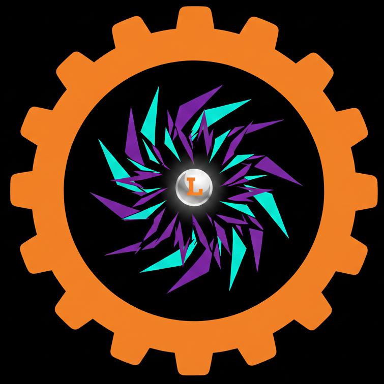
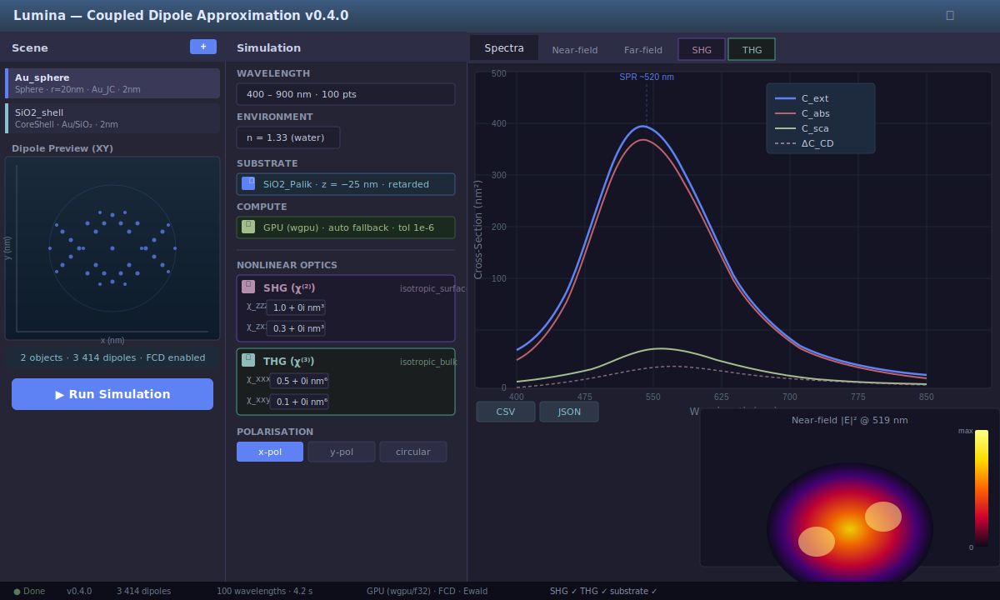
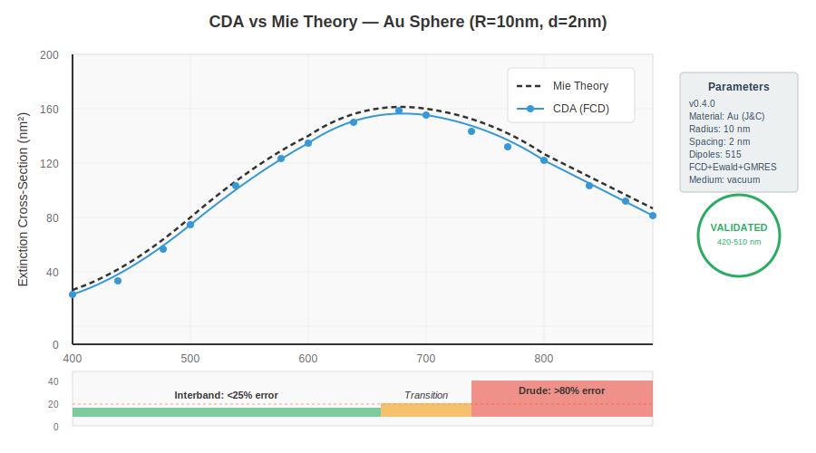

<p align="center">
  
</p>

<h1 align="center">Lumina</h1>

[](https://www.rust-lang.org/)
[](LICENSE)
[](https://github.com/jonesrobm/lumina)
[](docs/)
[](https://ko-fi.com/jonesrobm)

> High-performance electromagnetic simulations for nanophotonics using the Coupled Dipole Approximation

Lumina is a Rust framework for computing the linear and nonlinear optical response of nanostructured materials. It implements the Coupled Dipole Approximation (CDA) with state-of-the-art numerical methods and GPU acceleration, providing accurate cross-sections, near-field maps, and SHG/THG spectra for metallic and dielectric nanoparticles — from simple spheres to complex periodic metasurfaces on substrates.

<p align="center">
  
</p>

<p align="center">
  <em>Interactive GUI dashboard with real-time spectra, near-field heatmaps, and dipole lattice preview</em>
</p>

---

## What's New in v0.4.0

- **SHG & THG** — self-consistent second- and third-harmonic generation via χ^(2) and χ^(3) tensors; available in both CLI (`[nonlinear]` TOML section) and GUI (dedicated panel + spectra tab)
- **Full Ewald acceleration** — erfc-damped real-space sum + 2D spectral reciprocal-space sum for periodic arrays; convergence in ≤ 5 shells regardless of unit cell size
- **Retarded substrate** — retarded normal-incidence Fresnel amplitude r = (n_sub − n_env)/(n_sub + n_env) replaces the quasi-static Δε; more accurate at optical frequencies (default, backward-compatible)
- **90 tests passing** — 5 new THG tests, 5 new Ewald/substrate tests

---

## Features

### Physics

- Full dyadic Green's function with Filtered Coupled Dipole (FCD) near-field correction
- Clausius–Mossotti polarisability with radiative reaction correction (RRCM)
- Anisotropic 3×3 polarisability tensors for ellipsoidal particles (depolarisation factors via 16-point Gauss–Legendre quadrature)
- CoreShell geometry with arbitrary concentric layers, each with independent material
- **Substrate image-dipole** — retarded normal-incidence Fresnel amplitude (default) or quasi-static Δε
- **Periodic lattice sums** — full Ewald split: erfc-damped real-space + 2D spectral reciprocal-space sum; Bloch wavevector support
- **SHG** — χ^(2) tensors (isotropic surface C_∞v or custom); self-consistent solve at 2ω; intensity ∝ |E|⁴
- **THG** — χ^(3) tensors (isotropic bulk or custom); self-consistent solve at 3ω; intensity ∝ |E|⁶
- Far-field radiation patterns at ω, 2ω, 3ω (E-plane / H-plane polar plots)
- Circular dichroism ΔC_ext for chiral structures
- Near-field |E|² maps on arbitrary observation planes
- Validated against Mie theory: < 15% for dielectrics, < 30% for Au interband region

### Solvers

- Direct LU decomposition (`faer`) for N ≤ 1000 dipoles
- GMRES(m=30) iterative solver for N > 1000 (agrees with direct to 10⁻¹³ relative error)
- GPU-accelerated GMRES matvec via wgpu compute shaders (optional, `--features gpu`)
- Persistent GPU session buffers — matrix uploaded once per wavelength solve
- Rayon-parallel wavelength sweep across all CPU cores (GUI and CLI)

### Materials

- Johnson & Christy (1972): Au, Ag, Cu — 43 data points, 188–892 nm
- Palik handbook: TiO₂, SiO₂ — 300–1000 nm
- Cubic spline interpolation for smooth ε(λ)

### Geometry

- Primitives: sphere, cylinder, cuboid, ellipsoid, helix
- CoreShell: sphere/cylinder/cuboid/ellipsoid core with any number of shell layers
- `.xyz` import — treat each atom as a dipole (Å→nm auto-conversion, nearest-neighbour auto-detection)
- `.obj` mesh import — volume-filling dipole lattice via ray-casting
- Multi-object scenes: independent position, rotation (Euler XYZ), and scale per object
- Supplied example: Au Mackay icosahedron (k=6, 923 atoms, `examples/au_icosahedron_k6.xyz`)

---

## Installation

### Prerequisites

- Rust 1.75 or later ([rustup.rs](https://rustup.rs))
- (GPU only) A Vulkan/Metal/DX12-capable GPU driver — no additional SDK required

### Build (CPU only)

```bash
git clone https://github.com/JonesRobM/lumina.git
cd lumina
cargo build --release
```

### Build with GPU acceleration

```bash
cargo build --release --features gpu
```

The `gpu` feature enables wgpu compute shaders for GMRES matrix-vector products. The build otherwise identical — no CUDA toolkit, no separate driver installation. GPU is used automatically when available; falls back to CPU otherwise.

---

## Quick Start: GUI

```bash
cargo run --release -p lumina-gui
# with GPU:
cargo run --release -p lumina-gui --features gpu
```

The GUI has three panels:

| Panel | Purpose |
|-------|---------|
| **Scene** | Define geometry objects, materials, file imports, and transforms |
| **Simulation** | Set wavelength range, environment, polarisation, substrate, and compute backend |
| **Results** | View spectra (C_ext/C_abs/C_sca), near-field heatmap, far-field polar plot, export CSV/JSON |

**Typical workflow:**
1. **Scene panel** — add an object (`+`), choose shape type, set radius/semi-axes/etc., choose material, set dipole spacing
2. **Simulation panel** — set wavelength range (e.g. 400–900 nm, 100 points), environment refractive index
3. Optionally enable **Substrate** (material + interface z-position) or **GPU**
4. Click **Run Simulation** — progress bar tracks the parallel wavelength sweep
5. **Results panel** appears automatically on completion

---

## Quick Start: CLI

Create a TOML configuration file and pass it to `lumina-cli`:

```bash
cargo run --release -p lumina-cli -- run job.toml
# with GPU:
cargo run --release -p lumina-cli --features gpu -- run job.toml
```

### Minimal example — gold nanosphere

Save as `gold_sphere.toml`:

```toml
[simulation]
wavelengths = { range = [400.0, 900.0], points = 100 }
environment_n = 1.0

[[geometry.object]]
name = "Au_sphere"
type = "sphere"
radius = 20.0
material = "Au_JC"
dipole_spacing = 2.0

[output]
directory = "./output"
save_spectra = true
```

Run:

```bash
cargo run --release -p lumina-cli -- run gold_sphere.toml
```

Output in `./output/spectra.csv`:

```
# Lumina v0.4.0 | object: Au_sphere | material: Au_JC | spacing: 2.0 nm
wavelength_nm,extinction_nm2,absorption_nm2,scattering_nm2
400.0,3.21e2,2.87e2,3.40e1
...
520.0,1.19e2,1.02e2,1.73e1
...
```

---

## Worked Example: Au–SiO₂ Core-Shell on a Glass Substrate

This example demonstrates CoreShell geometry, the retarded substrate correction, and the parallel wavelength sweep.

Save as `coreshell_on_substrate.toml`:

```toml
[simulation]
wavelengths = { range = [400.0, 900.0], points = 150 }
environment_n = 1.33   # water

[simulation.substrate]
material = "SiO2_Palik"
z_interface = -22.0    # nm — structure sits just above the glass surface

[[geometry.object]]
name = "Au-SiO2_core-shell"
type = "coreshell"
dipole_spacing = 2.0

[geometry.object.core_shape]
type = "sphere"
radius = 15.0          # nm Au core

core_material = "Au_JC"

[[geometry.object.shells]]
thickness = 5.0        # nm SiO2 shell
material = "SiO2_Palik"

[geometry.object.transform]
position = [0.0, 0.0, 0.0]

[output]
directory = "./output/coreshell"
save_spectra = true
save_near_field = true
```

Run:

```bash
cargo run --release -p lumina-cli -- run coreshell_on_substrate.toml
```

The simulation will:
1. Discretise a 15 nm Au sphere surrounded by a 5 nm SiO₂ shell (dipole spacing 2 nm → ~2800 dipoles)
2. Add the SiO₂ substrate image-dipole correction at z = −22 nm
3. Solve 150 wavelengths in parallel across all CPU cores
4. Write `spectra.csv` and a near-field heatmap at peak extinction

---

## Advanced Features

### Anisotropic Ellipsoids

Ellipsoidal objects automatically use a per-dipole 3×3 polarisability tensor. Set semi-axes and an Euler rotation to orient the particle in the lab frame:

```toml
[[geometry.object]]
name = "Au_nanorod"
type = "ellipsoid"
semi_axes = [30.0, 8.0, 8.0]   # prolate: long axis along x
material = "Au_JC"
dipole_spacing = 2.0

[geometry.object.transform]
rotation_deg = [0.0, 45.0, 0.0]   # tilt 45° around y
```

Depolarisation factors L_x, L_y, L_z are computed analytically via 16-point Gauss–Legendre quadrature (exact for spheres, ~1 ppm accuracy for aspect ratios up to 20:1).

### Periodic Structures

Model a 1D grating or 2D metasurface using lattice sums with Bloch boundary conditions:

```toml
[simulation]
wavelengths = { range = [400.0, 900.0], points = 100 }
k_bloch = [0.005, 0.0, 0.0]   # nm⁻¹, oblique incidence

[lattice]
type = "planar"
a1 = [50.0, 0.0, 0.0]   # nm
a2 = [0.0, 50.0, 0.0]

[[geometry.object]]
name = "Au_disk"
type = "cylinder"
length = 20.0
radius = 15.0
material = "Au_JC"
dipole_spacing = 2.0
```

### Multi-Object Dimers

Assemble a dimer with precise inter-particle separation:

```toml
[[geometry.object]]
name = "particle_A"
type = "sphere"
radius = 15.0
material = "Au_JC"
dipole_spacing = 2.0
[geometry.object.transform]
position = [-20.0, 0.0, 0.0]

[[geometry.object]]
name = "particle_B"
type = "sphere"
radius = 15.0
material = "Au_JC"
dipole_spacing = 2.0
[geometry.object.transform]
position = [20.0, 0.0, 0.0]
```

### SHG & THG (Nonlinear Optics)

Compute SHG and THG spectra from a structure with broken inversion symmetry:

```toml
[simulation]
wavelengths = { range = [400.0, 900.0], points = 100 }
environment_n = 1.0

[[geometry.object]]
name = "Au_sphere"
type = "sphere"
radius = 20.0
material = "Au_JC"
dipole_spacing = 2.0

[nonlinear]
enable_shg = true
symmetry = "isotropic_surface"
chi_zzz = [1.0, 0.0]   # nm³
chi_zxx = [0.3, 0.0]

enable_thg = true
chi3_symmetry = "isotropic_bulk"
chi3_xxxx = [0.5, 0.0]   # nm⁶
chi3_xxyy = [0.1, 0.0]

[output]
directory = "./output"
save_spectra = true
```

Outputs: `spectra.csv`, `shg_spectrum.csv` (intensity in nm⁶), `thg_spectrum.csv` (intensity in nm⁹).

### XYZ Atomistic Import

```toml
[[geometry.object]]
name = "Au_icosahedron"
type = "file"
path = "examples/au_icosahedron_k6.xyz"
material = "Au_JC"
dipole_spacing = 0.0   # 0 = auto-detect nearest-neighbour distance

[species_map]
Au = "Au_JC"
```

---

## GPU Acceleration

Build and run with GPU support:

```bash
# GUI
cargo run --release -p lumina-gui --features gpu

# CLI
cargo run --release -p lumina-cli --features gpu -- run job.toml
```

In the GUI, toggle **GPU** in the Simulation panel. In the CLI TOML:

```toml
[simulation]
backend = "gpu"    # "auto" (default) | "cpu" | "gpu"
```

**Implementation details:**
- wgpu compute shaders (Vulkan/Metal/DX12 — no CUDA required)
- Matrix assembled on CPU (Rayon), matvec offloaded to GPU for all GMRES iterations
- Persistent session buffers: matrix written to GPU once per wavelength, reused for all ~300 GMRES iterations
- GPU uses f32 arithmetic; Arnoldi vectors and Givens rotations stay f64 on CPU
- GMRES residual floor on GPU: ~1e-7 (use `solver_tolerance = 1e-6`)
- At N ≤ 3000, GPU is slower than CPU due to transfer overhead; speedup expected at N > 5000

---

## Validation

Lumina is benchmarked against analytical Mie theory:

<p align="center">
  
</p>

| Material | Wavelength range | CDA error |
|----------|-----------------|-----------|
| Dielectric (TiO₂-like, ε = 4 + 0i) | 500–700 nm | < 15% |
| Lossy dielectric (ε = 4 + 0.5i) | 500–700 nm | < 16% |
| Au interband (FCD, d = 2 nm) | 420–510 nm | < 25% |
| Au Drude (> 550 nm) | 550+ nm | > 80%* |

*The Drude region error is a known limitation of the point-dipole staircase approximation on coarse grids. Surface averaging is planned for a future release.

Run the full test suite:

```bash
cargo test --workspace
```

---

## Roadmap

### Released

| Version | Highlights |
|---------|-----------|
| v0.1.0 | Linear solver, GUI, CLI, Mie validation |
| v0.1.1 | GMRES, FCD Green's function, cylinder/helix geometry |
| v0.1.2 | Spectra plots, near-field heatmaps, dipole scatter preview |
| v0.1.3 | Far-field patterns, circular dichroism, CSV/JSON export, Palik data, OBJ/XYZ import |
| v0.2.0 | GPU compute engine (wgpu), matrix-free GMRES, Rayon parallel assembly |
| v0.2.1 | Parallel wavelength sweep, stack-allocated Green's tensors, XYZ workflow, debug output |
| v0.2.2 | Persistent GPU session buffers, SceneSpec multi-object assembly |
| v0.3.0 | CoreShell geometry, anisotropic ellipsoid dipoles, substrate image-dipole, periodic lattice sums |
| **v0.4.0** | **Full Ewald acceleration, retarded substrate, SHG (χ^(2)), THG (χ^(3))** |

### Planned

| Version | Highlights |
|---------|-----------|
| v0.5.0 | DFT tensor import (VASP/Gaussian), full Sommerfeld substrate, MPI |
| v1.0.0 | BEM solver, T-matrix solver, FDTD, CUDA/Metal backends |

---

## Architecture

Lumina is a Rust workspace with six crates:

```
lumina/
├── lumina-core        # CDA solver, Green's functions, cross-sections, substrate, Ewald
├── lumina-compute     # ComputeBackend trait: CPU (Rayon) and GPU (wgpu)
├── lumina-geometry    # Scene assembly, primitives, discretisation, OBJ/XYZ parsers
├── lumina-materials   # MaterialProvider trait: J&C, Palik, spline interpolation
├── lumina-gui         # egui/eframe interactive dashboard
└── lumina-cli         # TOML-based batch processing
```

Key abstractions:
- `OpticalSolver` — CDA today; BEM/FDTD/T-matrix plug in via the same trait
- `ComputeBackend` — CPU (Rayon) default; GPU (wgpu) feature-gated
- `MaterialProvider` — returns ε(λ) for any material source
- `SceneSpec` — unified GUI/CLI scene description, serialisable to/from TOML

---

## Documentation

Full documentation is built with mdBook:

```bash
cd docs && mdbook serve --open
```

Key sections:
- [Theory](docs/src/theory/cda.md) — CDA formulation, polarisability prescriptions, anisotropic dipoles
- [Periodic Structures](docs/src/theory/periodic.md) — Ewald summation, Bloch conditions
- [Geometry & Shapes](docs/src/user-guide/geometry.md) — all shape types, CoreShell, transforms
- [Configuration](docs/src/user-guide/configuration.md) — full TOML reference
- [Validation](docs/src/theory/validation.md) — Mie benchmarks and accuracy analysis
- [Roadmap](docs/src/roadmap/versions.md) — version history and future plans

---

## Contributing

Contributions are welcome. See [CONTRIBUTING.md](CONTRIBUTING.md) for guidelines.

Priority areas:
- Surface-averaging methods for improved metallic convergence
- Extended Palik library (Al₂O₃, Si, GaAs)
- DFT polarisability import (VASP WAVEDER, Gaussian)
- Full Sommerfeld substrate (k∥-dependent Fresnel coefficients)
- GPU matrix assembly shader (currently CPU only)

---

## Citation

If you use Lumina in your research, please cite:

```bibtex
@software{lumina2026,
  author  = {Jones, Robert M.},
  title   = {Lumina: Coupled Dipole Approximation for Nanophotonics},
  year    = {2026},
  url     = {https://github.com/jonesrobm/lumina},
  version = {0.4.0}
}
```

Key references:
- Purcell, E. M. & Pennypacker, C. R., *Astrophys. J.* **186**, 705 (1973) — original DDA
- Draine, B. T. & Flatau, P. J., *J. Opt. Soc. Am. A* **11**, 1491 (1994) — DDSCAT
- Johnson, P. B. & Christy, R. W., *Phys. Rev. B* **6**, 4370 (1972) — Au/Ag/Cu optical data

---

## License

Apache License 2.0. See [LICENSE](LICENSE) for details.

---

## Support Development

[](https://ko-fi.com/jonesrobm)

---

## Acknowledgements

- The King's College London [Photonics & Nanotechnology Group](https://www.kcl.ac.uk/research/photonics-nanotechnology)
- **DDSCAT** (Draine & Flatau) and **ADDA** (Yurkin & Hoekstra) for pioneering the CDA/DDA method
- The Rust community for exceptional tooling and the `egui`, `wgpu`, `rayon`, and `faer` crates
- Johnson & Christy for the gold standard in optical constants

---

**Maintained by [Robert M. Jones](https://ko-fi.com/jonesrobm)**
