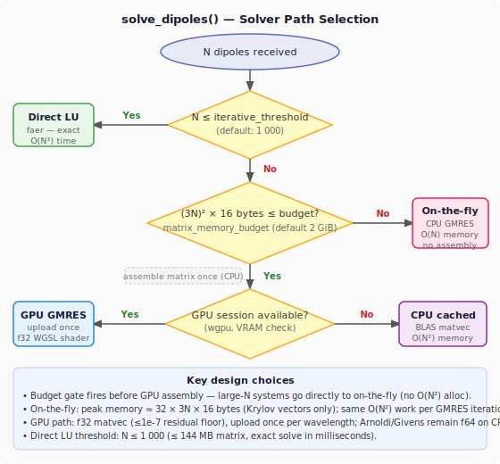
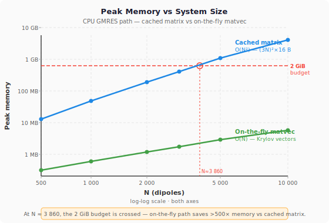

# Compute Backends

The `lumina-compute` crate provides a `ComputeBackend` trait that abstracts over different execution environments. Physics code in `lumina-core` calls `parallel_matrix_fill()` and `matvec()` without knowing whether the work runs on CPU or GPU.

## Available Backends

| Backend | Feature flag | Status | Description |
|---------|-------------|--------|-------------|
| CPU (Rayon) | `cpu` (default) | Implemented | Shared-memory parallelism via Rayon |
| GPU (wgpu) | `gpu` | Implemented (v0.2.0) | Compute shaders for matrix-vector products |
| Distributed (MPI) | `distributed` | Planned | Multi-node parallelism for HPC clusters |

### CPU (default)

Uses Rayon for shared-memory parallelism. Enabled by default via the `cpu` feature.

- **Matrix assembly:** Off-diagonal Green's tensor blocks computed in parallel via `rayon::par_iter`, then placed into the interaction matrix sequentially.
- **Matvec:** `ndarray` dense matrix-vector product (`matrix.dot(&vector)`).
- **Direct solve:** LU decomposition via `faer` for systems with N \\(\leq\\) 1000 dipoles.

### GPU (wgpu)

Uses wgpu v24 compute shaders for the GMRES matrix-vector product — the dominant cost for large systems (\\(N > 1000\\)).

Enabled via the `gpu` feature flag:

```bash
cargo build --release --features gpu
```

**Architecture:**

1. The interaction matrix is assembled on the CPU (Rayon-parallel).
2. The matrix is uploaded to the GPU once per wavelength and cached in VRAM.
3. Each GMRES iteration dispatches a WGSL compute shader for the complex matvec.
4. The Arnoldi orthogonalisation and Givens rotations remain on the CPU in f64.

**Key design decisions:**

- **f32 precision on GPU:** wgpu/WGSL does not support f64. The matrix and vectors are converted to `Complex<f32>` (stored as `vec2<f32>`) for the GPU matvec. The conversion overhead is O(N), negligible compared to the O(N\\(^2\\)) matvec.
- **Matrix caching:** The `GpuSession` holds 5 pre-allocated WGSL buffers (matrix, input, output, staging, params) and a pre-built bind group. The matrix is uploaded once; each GMRES iteration reuses all buffers (0 per-iteration allocations).
- **Automatic fallback:** If GPU initialisation fails (no compatible GPU, missing drivers), the solver falls back to `CpuBackend` with a log warning.
- **Memory budget gate (v0.4.1):** The GPU path is only entered if the matrix fits within `matrix_memory_budget` (default 2 GiB). For large N where the matrix would exceed this limit, the solver goes directly to the CPU on-the-fly path — preventing a silent O(N²) CPU allocation before a GPU upload attempt.

**Precision implications:**

The f32 matvec limits the achievable GMRES residual to approximately \\(10^{-7}\\). For most CDA applications this is more than adequate — the discretisation error (typically 5–25%) dominates. The solver tolerance should be set to \\(\geq 10^{-6}\\) when using GPU acceleration.

## Memory-Aware Solver Dispatch

For large systems the interaction matrix dominates memory. `CdaSolver::solve_dipoles` selects its sub-strategy based on the matrix size `(3N)² × 16 bytes` versus a configurable `matrix_memory_budget` (default 2 GiB):



| Condition | Path | Peak memory | Speed |
|-----------|------|-------------|-------|
| N ≤ 1 000 | Direct LU (faer) | O(N²) | Fastest |
| matrix_bytes ≤ budget AND GPU | GPU GMRES | O(N²) CPU + VRAM | Fast at N > 5 000 |
| matrix_bytes ≤ budget, no GPU | CPU cached GMRES | O(N²) | Good |
| matrix_bytes > budget | **On-the-fly GMRES** | **O(N)** | Slower per iter |

### On-the-fly Matvec

When the matrix exceeds the budget, `assembly::matvec_on_the_fly` is used instead:

```rust
// No matrix is ever assembled. For each GMRES iteration:
// result[3i..3i+3] = α_i⁻¹ · x[3i..3i+3]  (diagonal)
//                  + Σⱼ₌ᵢ -G(rᵢ, rⱼ) · x[3j..3j+3]  (off-diagonal)
// Rows are computed in parallel (Rayon par_iter over i).
```

Peak memory is proportional to the Krylov subspace only:
\\[
M_\text{on-the-fly} \approx (m+1) \times 3N \times 16 \text{ bytes}
\\]
where \\(m = 30\\) is the GMRES restart parameter.

### Memory Scaling



The crossover from "fits in budget" to "on-the-fly" occurs at:
\\[
N_\text{cross} = \frac{1}{3} \sqrt{\frac{M_\text{budget}}{16}} \approx 3\,860 \text{ at the 2 GiB default}
\\]

At N = 10 000:
- **Cached matrix**: 14.4 GB — requires a workstation with ample RAM
- **On-the-fly**: ~47 MB — runs on any laptop

### Configuring the Budget

In the TOML configuration:

```toml
[simulation]
# Increase to cache larger matrices (faster, but needs more RAM)
matrix_memory_gib = 8.0

# Set to 0 to always use on-the-fly (lowest memory, slower)
matrix_memory_gib = 0.0
```

**WGSL shader:**

The compute shader (`crates/lumina-compute/src/shaders/matvec.wgsl`) performs one complex dot product per thread (one row of the matrix). Complex multiplication uses the standard `(a+bi)(c+di) = (ac-bd) + (ad+bc)i` formula with `vec2<f32>` storage.

```wgsl
@compute @workgroup_size(256)
fn main(@builtin(global_invocation_id) gid: vec3<u32>) {
    let row = gid.x;
    // ... complex dot product for row ...
    output_vec[row] = sum;
}
```

### Distributed (planned)

MPI-based multi-node parallelism for HPC clusters. Block-row distribution of the interaction matrix with hybrid MPI+Rayon within each node.

Enabled via the `distributed` feature flag.

## Backend Selection

### In TOML configuration (CLI)

```toml
[simulation]
backend = "auto"   # "cpu", "gpu", or "auto" (default)
```

- `"auto"` — tries GPU first, falls back to CPU if unavailable
- `"cpu"` — always use CPU (useful for reproducibility or debugging)
- `"gpu"` — require GPU (errors if unavailable)

### In the GUI

The simulation panel includes a **GPU acceleration** checkbox. This is only visible when the binary is built with `--features gpu`.

### Programmatic (Rust API)

```rust
use std::sync::Arc;
use lumina_compute::{ComputeBackend, CpuBackend};
use lumina_core::solver::cda::CdaSolver;

// Default: CpuBackend
let solver = CdaSolver::default();

// Explicit GPU backend
#[cfg(feature = "gpu")]
{
    use lumina_compute::GpuBackend;
    let gpu = Arc::new(GpuBackend::new_blocking().expect("GPU init failed"));
    let solver = CdaSolver::with_backend(gpu);
}
```

## Performance

Benchmark results (NVIDIA RTX 4050 Laptop GPU, release mode):

### Matvec (single A\\(\cdot\\)x)

| N (3N\\(\times\\)3N) | CPU (ms) | GPU (ms) | Speedup |
|----------------------|----------|----------|---------|
| 300 | 0.06 | 1.1 | 0.05\\(\times\\) |
| 1 000 | 1.1 | 6.1 | 0.18\\(\times\\) |
| 3 000 | 16.9 | 55.5 | 0.30\\(\times\\) |

### GMRES solve

| N (3N\\(\times\\)3N) | CPU (ms) | GPU (ms) | Speedup |
|----------------------|----------|----------|---------|
| 300 | 0.5 | 13.1 | 0.04\\(\times\\) |
| 1 000 | 9.1 | 35.7 | 0.26\\(\times\\) |
| 3 000 | 83.8 | 406.5 | 0.21\\(\times\\) |

At N \\(\leq\\) 3 000, the GPU is slower than CPU due to per-call buffer overhead (input/output/staging buffer creation and readback latency). The crossover point is expected at N \\(>\\) 5 000, where the O(N\\(^2\\)) computation dominates over the constant overhead. Persistent buffer reuse is planned for v0.2.1.

## Implementing a New Backend

Implement the `ComputeBackend` trait:

```rust
pub trait ComputeBackend: Send + Sync {
    fn device_info(&self) -> DeviceInfo;
    fn parallel_matrix_fill(
        &self, rows: usize, cols: usize,
        fill_fn: &(dyn Fn(usize, usize) -> Complex64 + Send + Sync),
    ) -> Result<Array2<Complex64>, ComputeError>;
    fn matvec(
        &self, matrix: &Array2<Complex64>, vector: &Array1<Complex64>,
    ) -> Result<Array1<Complex64>, ComputeError>;
    fn dense_solve(
        &self, matrix: &Array2<Complex64>, rhs: &Array1<Complex64>,
    ) -> Result<Array1<Complex64>, ComputeError>;
}
```

The `dense_solve` method has a default implementation that returns `Err(ComputeError::Unavailable)`. Override it if your backend supports dense linear solves.
